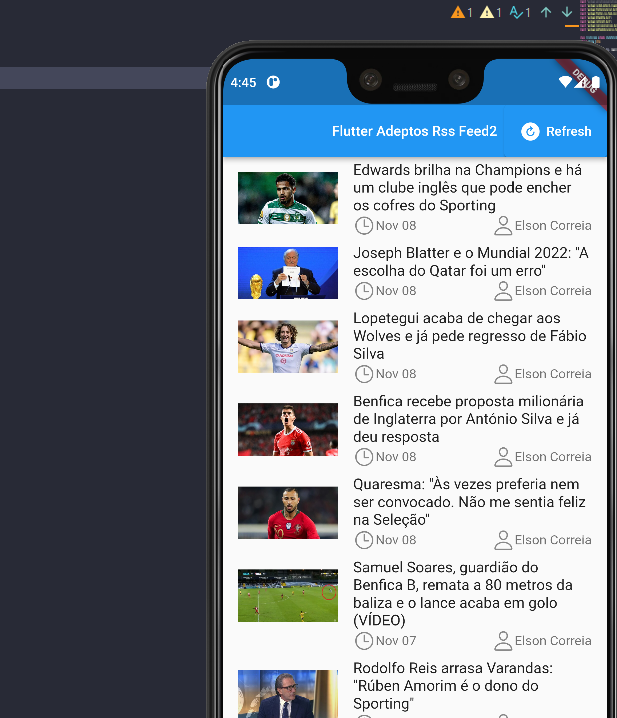
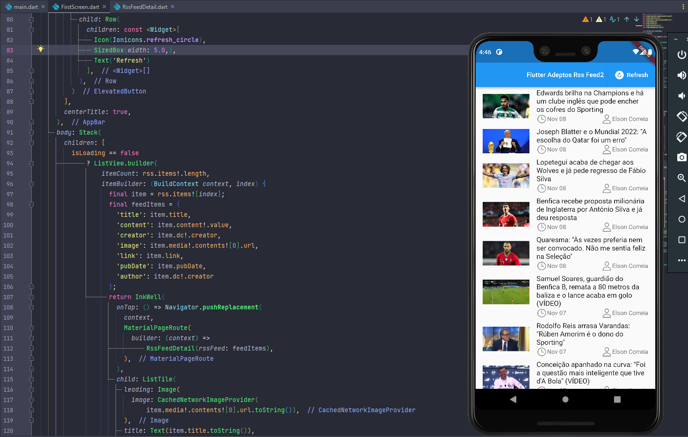
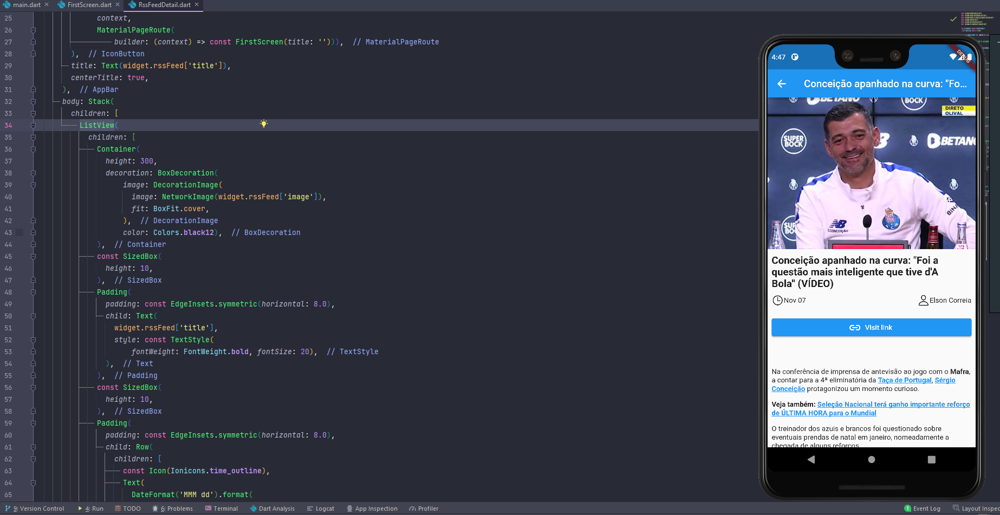

# flutter_rss_feed_1

A Flutter Project With RSS Backend

## Details

This project is a very simple demo without architecture and state management for just show how to parse RSS XML feed contents to the flutter application.

this project use packages below:

* http
* webfeed
* cached network image
* ionicons
* flutter html
* flutter launcher icons
* intl
* url launcher

ScreenShot 1:

Screenshot2 :

Screenshot3 :

